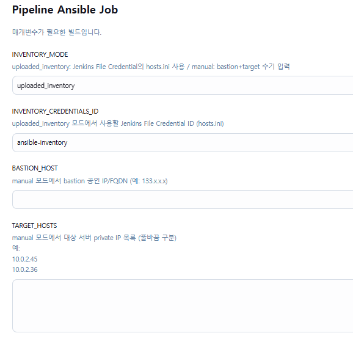
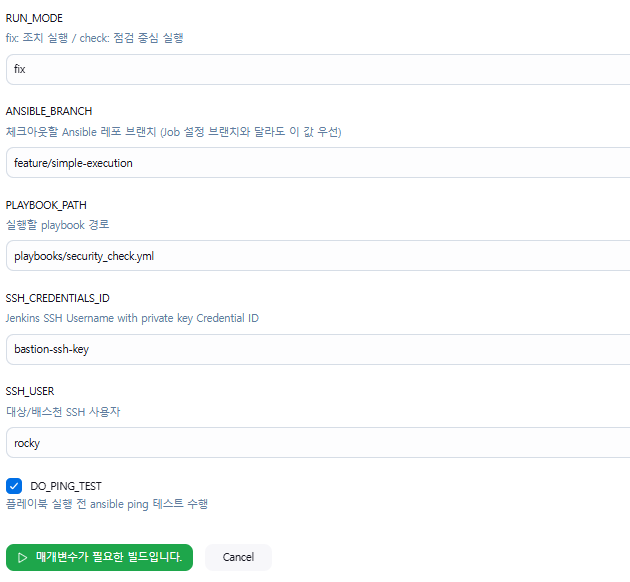

## 개요
이 프로젝트는 Rocky Linux 계열 서버를 대상으로 보안 조치 스크립트를 Ansible로 배포/실행하고,  
Jenkins Pipeline을 통해 inventory 기반으로 자동 실행할 수 있도록 구성한 레포입니다.

  

  

현재 기준으로 다음 방식으로 동작합니다.

- `uploaded_inventory` 또는 `manual` 방식으로 대상 서버 결정
- bastion 경유 SSH 접속 지원
- 조치 스크립트 순차 실행
- 결과는 Jenkins 아티팩트(summary + raw)와 대상 서버 latest summary로 분리 저장

## 디렉토리 구조
- `inventory/hosts.ini.example` : inventory 예시 파일
- `playbooks/security_check.yml` : 메인 실행 플레이북
- `playbooks/roles/security_script/tasks/main.yml` : 조치 실행 및 로그 생성 로직
- `playbooks/roles/security_script/files/` : U-01 ~ U-67 스크립트
- `Jenkinsfile` : Jenkins Pipeline 정의
- `logs/` : Jenkins 실행 후 summary/raw 로그 저장 위치

## 사전 작업
### 컨트롤 노드 / Jenkins
- Ansible 설치
- SSH 클라이언트 설치
- Jenkins SSH Credential 등록
- Jenkins Inventory File Credential 등록

### 대상 서버
- Rocky Linux / RHEL 계열
- SSH 접속 가능
- `rocky` 계정 사용 가능
- sudo 사용 가능
- bastion 또는 직접 접속 경로 확보

## Jenkins에서 사용자가 수동으로 추가해야 하는 것
### 1. Inventory 파일
실제 대상 서버 정보가 담긴 `hosts.ini` 파일을 사용자가 별도로 준비하여 Jenkins에 업로드합니다.

- **Kind**: `Secret file`
- **ID**: `ansible-inventory`

### 2. SSH Key
대상 서버 또는 bastion 접속에 사용하는 SSH 개인키를 Jenkins Credential에 등록합니다.

- **Kind**: `SSH Username with private key`
- **ID**: 예) `bastion-ssh-key`
- **Username**: 예) `rocky`

## 동작 방식
### uploaded_inventory
- Jenkins에 업로드한 `hosts.ini`를 읽어 실행
- 권장 방식

### manual
- Jenkins 파라미터(`BASTION_HOST`, `TARGET_HOSTS`)로 runtime inventory 생성
- 테스트/임시 실행용

## 실행 결과
### Jenkins
서버별로 실행 시점 기준 로그 2개를 아티팩트로 저장합니다.

- `<host>_<timestamp>_summary.log`
- `<host>_<timestamp>_raw.log`

### 대상 서버
대상 서버에는 최신 summary 로그 1개를 저장합니다.

- `/opt/security/logs/<host>/<host>_last_summary.log`

## 요약
- Jenkins : summary + raw 보관
- 대상 서버 : latest summary 보관
- inventory는 사용자가 수동 업로드
- SSH key는 Jenkins Credential로 관리

---

## Overview
This repository is designed to deploy and execute security remediation scripts on Rocky Linux-based servers using Ansible,  
and to run them through a Jenkins Pipeline based on inventory-driven execution.

Current behavior:

- Target hosts are selected using either `uploaded_inventory` or `manual` mode
- Bastion-based SSH access is supported
- Security scripts are executed sequentially
- Results are stored as Jenkins artifacts (summary + raw) and as the latest summary on each target host

## Directory Structure
- `inventory/hosts.ini.example` : example inventory file
- `playbooks/security_check.yml` : main playbook
- `playbooks/roles/security_script/tasks/main.yml` : execution and log-generation logic
- `playbooks/roles/security_script/files/` : U-01 ~ U-67 scripts
- `Jenkinsfile` : Jenkins Pipeline definition
- `logs/` : summary/raw logs generated during Jenkins execution

## Prerequisites
### Control node / Jenkins
- Ansible installed
- SSH client installed
- Jenkins SSH Credential configured
- Jenkins Inventory File Credential configured

### Target servers
- Rocky Linux / RHEL family
- SSH reachable
- `rocky` account available
- sudo available
- direct or bastion-based access path prepared

## What the user must add manually in Jenkins
### 1. Inventory file
The user must prepare and upload a real `hosts.ini` file containing actual target host information.

- **Kind**: `Secret file`
- **ID**: `ansible-inventory`

### 2. SSH key
The SSH private key used for target or bastion access must be registered in Jenkins.

- **Kind**: `SSH Username with private key`
- **ID**: e.g. `bastion-ssh-key`
- **Username**: e.g. `rocky`

## Execution Modes
### uploaded_inventory
- Uses the uploaded `hosts.ini` from Jenkins
- Recommended mode

### manual
- Builds runtime inventory from Jenkins parameters (`BASTION_HOST`, `TARGET_HOSTS`)
- Intended for temporary or test runs

## Output
### Jenkins
For each host and each run, Jenkins archives two logs:

- `<host>_<timestamp>_summary.log`
- `<host>_<timestamp>_raw.log`

### Target host
Each target host keeps one latest summary log:

- `/opt/security/logs/<host>/<host>_last_summary.log`

## Summary
- Jenkins keeps summary + raw logs
- Target hosts keep only the latest summary
- Inventory is manually uploaded by the user
- SSH keys are managed through Jenkins Credentials